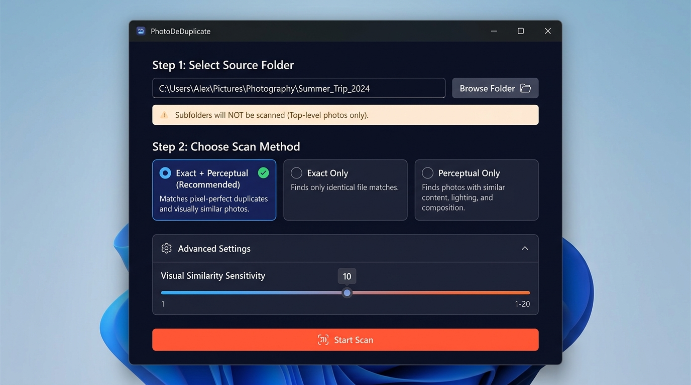
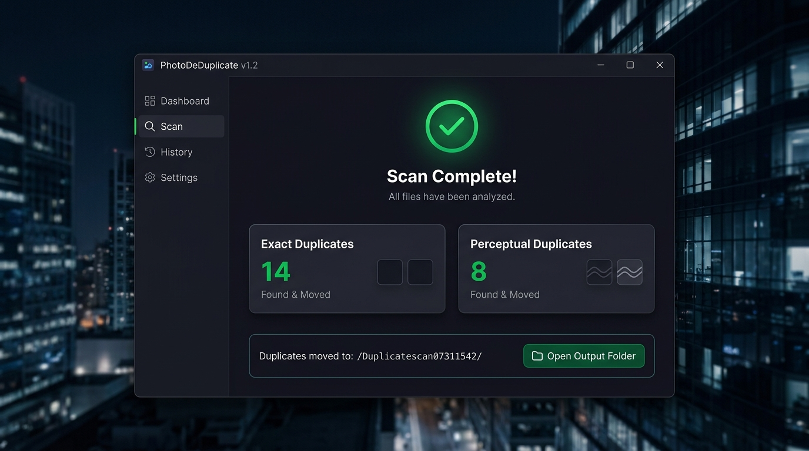

# PhotoDeDuplicate `v0.1.0`

> Non-destructive desktop application to scan folders and safely isolate duplicate images — files are **moved**, never deleted!

[](https://github.com/gavinfischer-keenan/photoDeDuplicate/releases/tag/v0.1.0)
[](https://github.com/gavinfischer-keenan/photoDeDuplicate/releases/tag/v0.1.0)
[](https://github.com/gavinfischer-keenan/photoDeDuplicate/releases/tag/v0.1.0)
[](LICENSE)

---

## 🚀 Download Windows Installer (.exe)

| Release | Platform | Download Link | Status |
| :--- | :--- | :--- | :--- |
| **v0.1.0 (Usable Release)** | Windows (x64) | [**Download PhotoDeDuplicate Setup 0.1.0.exe**](https://github.com/gavinfischer-keenan/photoDeDuplicate/releases/tag/v0.1.0) | 🟢 Stable / Usable |

> **Installation Note**: Double-click `PhotoDeDuplicate Setup 0.1.0.exe` to run the setup wizard. You can choose your install directory and create Start Menu / Desktop shortcuts.

---

## 📸 Interface Preview & Screenshots

### 1. Folder Selection & Mode Configuration
Pick any target folder, view subfolder warnings, select scan mode, and adjust perceptual similarity tolerance:



### 2. Live Scan & Duplicate Isolation Results
Track scan progress in real-time, view detailed duplicate counts, and open the organized output folder:



---

## ✨ Features

- **Double-Layer Scanning Engine**:
  - 🔍 **Exact Matching**: Streaming SHA-256 cryptographic hashes find byte-for-byte identical duplicates instantly.
  - 🎨 **Perceptual Matching**: 64-bit difference hashing (dHash via `sharp`) detects visually similar photos (resized, compressed, or slightly altered).
- **100% Non-Destructive**:
  - Files are **moved**, never deleted.
  - Automatically creates a timestamped folder: `DuplicatescanMMDDHHMM/` containing `Exact/` and `Perceptual/` subdirectories.
- **Subfolder Safety Warning**:
  - Automatically checks if the chosen directory contains subfolders and alerts the user that subfolders are excluded from scanning.
- **Customizable Sensitivity**:
  - Includes an **Advanced Settings** drawer with a interactive slider to adjust perceptual Hamming distance threshold (from strict 1 to loose 20).
- **Modern Dark UI**:
  - Polished responsive desktop interface built with glassmorphism aesthetics, progress animations, and single-click folder exploration.

---

## 🛠️ How It Works

```
                        ┌──────────────────────────────┐
                        │   Selected Target Folder     │
                        └──────────────┬───────────────┘
                                       │
                        ┌──────────────┴───────────────┐
                        │  Check Subfolder Safety Flag │
                        └──────────────┬───────────────┘
                                       │
                 ┌─────────────────────┴─────────────────────┐
                 │                                           │
       ┌─────────▼──────────┐                     ┌──────────▼─────────┐
       │   Phase 1: Exact   │                     │ Phase 2: Perceptual│
       │   (SHA-256 Stream) │                     │ (dHash 9x8 Gray)   │
       └─────────┬──────────┘                     └──────────┬─────────┘
                 │                                           │
                 │ Group Byte Matches                        │ Group Visual Matches
                 ▼                                           ▼
       ┌────────────────────┐                     ┌────────────────────┐
       │ Moves Duplicates   │                     │ Moves Duplicates   │
       │  to /Exact/        │                     │  to /Perceptual/   │
       └────────────────────┘                     └────────────────────┘
```

### 1. Exact Matching Algorithm
- Streams file data into Node.js `crypto.createHash('sha256')` to prevent memory overload.
- Sorts duplicate candidates alphabetically; retains the first file in place and marks remaining byte-identical copies as duplicates.

### 2. Perceptual Matching Algorithm (dHash)
- Downsamples image to $9 \times 8$ grayscale using `sharp`.
- Compares adjacent pixel luminances ($L < R \rightarrow 1$) generating a 64-bit binary fingerprint.
- Compares fingerprints using bitwise XOR Hamming distance ($H \le \text{Threshold}$).

---

## 📂 Output Folder Structure

When duplicates are found in your folder (e.g. `C:\Users\You\Pictures\Vacation`), PhotoDeDuplicate creates an organized subfolder:

```text
Vacation/
├── IMG_0001.JPG                  ← Kept (Original)
├── IMG_0002.JPG                  ← Kept (Original)
└── Duplicatescan07311542/        ← Timestamped output folder (MMDDHHMM)
    ├── Exact/
    │   └── IMG_0001_copy.JPG     ← Byte-identical copy moved here
    └── Perceptual/
        └── IMG_0002_resized.JPG  ← Visually similar version moved here
```

---

## ⚙️ Building & Development

### Requirements
- **Node.js**: v18+
- **npm**: v9+

### Commands

```bash
# Install dependencies
npm install

# Run automated test suite (41 tests)
npm test

# Launch local development window
npm start

# Package production NSIS installer (.exe)
npm run dist
```

---

## 📜 Architecture Documentation

For complete technical specifications, component hierarchy, IPC communication schemas, and security design, see [ARCHITECTURE.md](ARCHITECTURE.md).

---

## 📄 License

Distributed under the MIT License. See [LICENSE](LICENSE) for more information.
